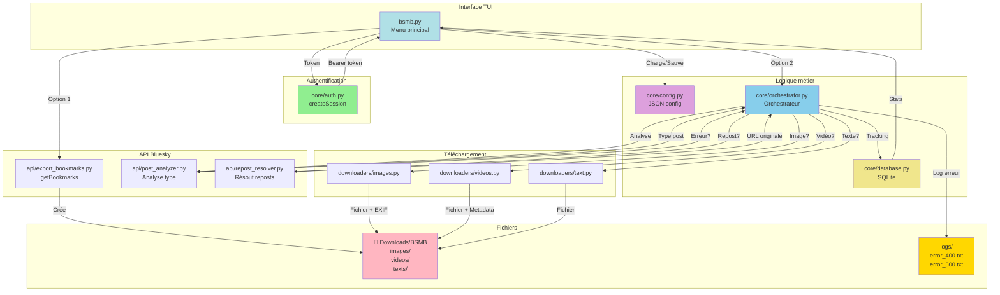
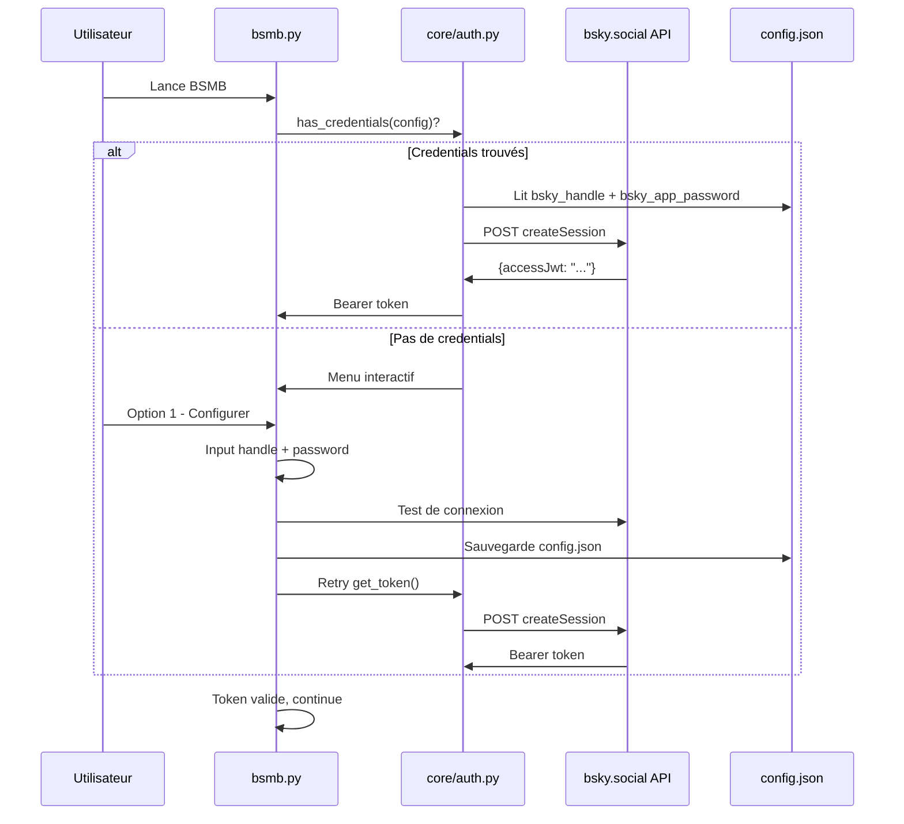

# 🏗️ Guide de développement avancé

Ce document explique l'architecture interne et les patterns utilisés dans BSMB.

---

## 📊 Architecture générale

### Diagramme de flux complet



### Cycles d'exécution

#### Export (Option 1)
```
bsmb.py
  → check_token() - Récupère token Bearer
  → export_bookmarks.py (subprocess)
      → os.environ.get("BSMB_TOKEN")
      → API getBookmarks (paginated)
      → Crée urls.txt
```

#### Téléchargement (Option 2)
```
bsmb.py
  → check_token() - Vérifie token
  → Charge urls.txt
  → database.get_new_posts(urls) - Filtre les nouveaux
  → orchestrator.py (subprocess) avec URL list
      → Pour chaque URL:
          → post_analyzer.analyze()
          → Détecte PostType
          → Si repost → repost_resolver.resolve()
          → Télécharge média via downloader/
          → database.add_post() + add_media()
      → Rapport final
```

---

## 🔐 Authentification (core/auth.py)

### Flux createSession



### Code clé

```python
def create_session(handle, app_password):
    """
    POST com.atproto.server.createSession

    Args:
        handle: user.bsky.social
        app_password: xxxx-xxxx-xxxx-xxxx

    Returns:
        str: "Bearer {accessJwt}"

    Raises:
        AuthError: 401 (invalides), 429 (rate limit), etc.
    """
    resp = requests.post(
        "https://bsky.social/xrpc/com.atproto.server.createSession",
        json={"identifier": handle, "password": app_password},
        timeout=15
    )

    # Gestion d'erreurs spécifiques
    if resp.status_code == 401:
        raise AuthError("Identifiants invalides")
    if resp.status_code == 429:
        raise AuthError("Rate limit - réessayez dans quelques minutes")

    resp.raise_for_status()
    data = resp.json()
    access_jwt = data.get("accessJwt")

    return f"Bearer {access_jwt}"

def get_token(config):
    """
    Obtient token par ordre de priorité:
    1. createSession (si credentials)
    2. Token-Bearer.txt (fallback)
    """
    if config.get("bsky_handle") and config.get("bsky_app_password"):
        return create_session(...)  # Peut lever AuthError

    # Fallback
    token_file = Path(config.get("token_file", "Token-Bearer.txt"))
    if token_file.exists():
        content = token_file.read_text(encoding="utf-8").strip()
        if content.startswith("Bearer "):
            return content

    return None
```

### Passage du token à export_bookmarks.py

```python
# Dans bsmb.py - export_bookmarks()
token = check_token(config)  # Retourne le Bearer token

env = os.environ.copy()
env["BSMB_TOKEN"] = token

subprocess.run(
    ["python", "api/export_bookmarks.py"],
    env=env,  # Passe token via env var
    encoding="utf-8"
)
```

```python
# Dans api/export_bookmarks.py
TOKEN = os.environ.get("BSMB_TOKEN", "").strip()

if not TOKEN:
    # Fallback sur Token-Bearer.txt
    TOKEN_FILE = Path("Token-Bearer.txt")
    if TOKEN_FILE.exists():
        TOKEN = TOKEN_FILE.read_text(encoding="utf-8").strip()
    else:
        sys.exit(1)
```

---

## 🗃️ Configuration (core/config.py)

### Modèle de données

```python
DEFAULT_CONFIG = {
    # Chemins
    "download_dir": str(Path.home() / "Downloads" / "BSMB"),
    "token_file": "Token-Bearer.txt",
    "urls_file": "urls.txt",
    "db_file": "bsmb.db",
    "logs_dir": "logs",

    # Limites
    "max_logs": 5,
    "max_filename_len": 64,
    "min_postid_short": 4,
    "index_digits": 1,

    # Authentification (NEW)
    "bsky_handle": "",
    "bsky_app_password": "",
}
```

### Cycle de vie

```python
# Chargement
config = load_config()
# → Merge DEFAULT_CONFIG + fichier config.json
# → Migration auto (img_dir → download_dir)

# Utilisation
config["download_dir"]
config.get("bsky_handle", "")

# Sauvegarde
save_config(config)
# → Écrit en JSON, UTF-8, indentation 2

# Préparation répertoires
ensure_dirs(config)
# → Crée images/, videos/, texts/
```

---

## 📊 Base de données (core/database.py)

### Schéma SQLite

```sql
CREATE TABLE posts (
    url TEXT PRIMARY KEY,
    post_id TEXT,
    handle TEXT,
    last_check DATETIME,
    success BOOLEAN
);

CREATE TABLE media (
    id INTEGER PRIMARY KEY AUTOINCREMENT,
    url TEXT,
    type TEXT,  -- 'image', 'video', 'text'
    filename TEXT,
    added_at DATETIME
);
```

### API principale

```python
db = Database("bsmb.db")

# Ajouter post
db.add_post(url, post_id, handle)

# Récupérer nouveaux posts
new_urls = db.get_new_posts(all_urls)

# Ajouter média
db.add_media(url, "image", "artiste_20260110_3abc123xyz_01.jpg")

# Stats
stats = db.get_stats()
# → {"posts": 42, "images": 156, "videos": 23}

# Nettoyage
db.close()
```

---

## 🔍 Analyse de posts (api/post_analyzer.py)

### PostType enum

```python
class PostType(Enum):
    IMAGES = "images"
    VIDEO = "video"
    TEXT_ONLY = "text_only"
    REPOST = "repost"
    ERROR_400 = "error_400"
    ERROR_500 = "error_500"
    UNKNOWN = "unknown"
```

### Analyse

```python
analyzer = PostAnalyzer()

post_type, data, debug_info = analyzer.analyze(url)

# Exemples de retour
if post_type == PostType.IMAGES:
    # data = {"image_count": 3, "images": [...], "handle": "artiste", "text": "..."}
    pass
elif post_type == PostType.VIDEO:
    # data = {"video_url": "...", "handle": "...", ...}
    pass
elif post_type == PostType.REPOST:
    # data = {"original_uri": "...", ...}  # Fournit URI originale
    pass
elif post_type == PostType.ERROR_400:
    # Post supprimé
    pass
```

---

## 🎯 Orchestrateur (core/orchestrator.py)

### Entrée
```bash
python orchestrator.py <IMG_DIR> <VID_DIR> [--no-db] <URL1> <URL2> ...
```

### Sortie
```
Rapport structuré:
  RÉSULTATS
    Posts traités: X/Y
    Images: Z
    Vidéos: A
    Textes: B

  PROBLÈMES (si présents)
    Posts supprimés (400): C
    Erreurs serveur (500): D
    Reposts non résolus: E
    Types inconnus: F
    Échecs: G

  MÉTRIQUES
    Durée: X min Y sec
    Poids total: Z MB

  FICHIERS GÉNÉRÉS
    error_400_20260110_154842.txt
    error_500_20260110_154842.txt
    ...
```

### Processus par post

```python
def process_post(url, IMG_DIR, VID_DIR, db, analyzer, resolver, logs_dir):
    """Traite UN post complet."""

    # 1. Analyse
    spinner = Spinner("Analyse du post")
    post_type, data, debug_info = analyzer.analyze(url)
    spinner.stop()

    # 2. Gestion erreurs
    if post_type == PostType.ERROR_400:
        return False, 0, 0, 0, 'error_400'
    if post_type == PostType.ERROR_500:
        return False, 0, 0, 0, 'error_500'

    # 3. Résolution repost
    if post_type == PostType.REPOST:
        original_url = resolver.resolve(url)
        if original_url:
            return process_post(original_url, ...)  # Récursif

    # 4. Téléchargement
    if post_type == PostType.IMAGES:
        # Appel subprocess images.py
        img_count = télécharger_images(url, IMG_DIR)
    elif post_type == PostType.VIDEO:
        # Appel subprocess videos.py
        vid_count = télécharger_vidéo(url, VID_DIR)

    # 5. Tracking DB
    if db:
        for media in downloaded:
            db.add_media(url, media.type, media.filename)

    return success, img_count, vid_count, txt_count, 'success'
```

---

## ⬇️ Téléchargeurs

### Pattern subprocess

```python
# Dans orchestrator.py
result = subprocess.run(
    ["python", "downloaders/images.py", IMG_DIR, url],
    capture_output=True,
    text=True,
    encoding="utf-8",
    errors="replace"
)

if result.returncode == 0:
    # Parser stdout pour count
    lines = result.stdout.strip().split("\n")
    for line in lines:
        if "Téléchargée:" in line:
            count += 1
else:
    # Erreur - log dans orchestrator
    print(f"Erreur: {result.stderr}")
```

### images.py

```bash
python downloaders/images.py <IMG_DIR> <URL>
```

**Retour stdout:**
```
Téléchargée: artiste_20260110_3abc123xyz_01.jpg
Téléchargée: artiste_20260110_3abc123xyz_02.jpg
```

**Métadonnées EXIF:**
```
Title        = post_id
XPComment    = texte du post + URL complète
Artist       = handle auteur
DateTimeOriginal = date création
Copyright    = URL complète post
```

### videos.py

```bash
python downloaders/videos.py <VID_DIR> <URL>
```

**Métadonnées ffmpeg:**
```
-metadata title=post_id
-metadata comment=texte_post_url
-metadata artist=handle
-metadata creation_time=date
```

---

## 🎨 UI - Classe Colors (core/colors.py)

### Pattern Singleton

```python
from core.colors import c  # Instance globale

# Partout dans le code
print(c.success("Opération réussie"))
print(c.error("Erreur!"))
print(c.title("SECTION TITLE"))
print(c.box_header("MON MENU"))
print(c.menu_option("1", "Option description"))
```

### Détection couleurs

```python
def _detect_color_support(force_color):
    # 1. Force via param/env
    if force_color is not None:
        return force_color
    if os.environ.get("NO_COLOR"):
        return False
    if os.environ.get("FORCE_COLOR"):
        return True

    # 2. Détection Windows Terminal
    if os.environ.get("WT_SESSION"):
        return True

    # 3. Windows 10+ - Activer ANSI mode via kernel32
    if sys.platform == "win32":
        try:
            import ctypes
            kernel32 = ctypes.windll.kernel32
            handle = kernel32.GetStdHandle(-11)  # STD_OUTPUT_HANDLE
            mode = ctypes.c_ulong()
            kernel32.GetConsoleMode(handle, ctypes.byref(mode))
            kernel32.SetConsoleMode(handle, mode.value | 0x0004)  # ENABLE_VIRTUAL_TERMINAL_PROCESSING
            return True
        except:
            return False

    # 4. Unix - isatty
    return hasattr(sys.stdout, "isatty") and sys.stdout.isatty()
```

### Codes couleurs

```python
# De base
RED, GREEN, YELLOW, BLUE, CYAN, WHITE, MAGENTA
LIGHT_RED, LIGHT_GREEN, ...

# Styles
BOLD, DIM, UNDERLINE, RESET

# Sémantiques
SUCCESS (vert) = [OK]
ERROR (rouge) = [ERREUR]
WARNING (jaune) = [ATTENTION]
INFO (bleu) = [INFO]
VALUE (cyan) = valeurs/chemins
KEY (blanc) = labels
PROMPT (jaune) = inputs
```

---

## 🧪 Patterns de test

### Structure
```python
import pytest
from core.auth import create_session, AuthError

class TestCreateSession:
    """Tests pour create_session()"""

    def test_valid_credentials(self, mocker):
        """Vérifie que token est retourné avec credentials valides"""
        mock_post = mocker.patch("requests.post")
        mock_post.return_value.json.return_value = {
            "accessJwt": "abc123..."
        }

        result = create_session("user.bsky.social", "xxxx-xxxx-xxxx-xxxx")

        assert result.startswith("Bearer ")
        assert "abc123" in result

    def test_invalid_credentials(self, mocker):
        """Vérifie que AuthError est levée avec identifiants invalides"""
        mock_post = mocker.patch("requests.post")
        mock_post.return_value.status_code = 401

        with pytest.raises(AuthError) as exc_info:
            create_session("invalid", "invalid")

        assert "invalides" in str(exc_info.value).lower()

    def test_rate_limit(self, mocker):
        """Vérifie la gestion du rate limiting"""
        mock_post = mocker.patch("requests.post")
        mock_post.return_value.status_code = 429

        with pytest.raises(AuthError) as exc_info:
            create_session("user.bsky.social", "xxxx-xxxx-xxxx-xxxx")

        assert "réessayez" in str(exc_info.value).lower()
```

---

## 🔄 Patterns d'erreur

### Gestion d'erreurs cohérente

```python
# ✅ BON - Par post, pas global
def process_post(url, ...):
    try:
        post_type, data = analyze(url)
    except Exception as e:
        log_func(f"ERREUR: {url}", to_console=False)
        return False, 0, 0, 0, 'failed'

    # Continuer même si un post échoue
    return success, counts...

# ❌ MAUVAIS - Crash global
def process_posts(urls):
    for url in urls:
        analyze(url)  # Si erreur, tout s'arrête!
```

### Logging structuré

```python
# Fichiers séparés par type d'erreur
logs/
├── error_400_20260110_154842.txt    # Posts supprimés
├── error_500_20260110_154842.txt    # Erreurs serveur
├── reposts_unresolved_20260110_154842.txt
├── unknown_types_20260110_154842.txt
└── orchestrator_20260110_154842.log # Détails complets
```

---

## 📈 Performance

### Optimisations actuelles
- Base données SQLite pour tracking rapide
- Pagination getBookmarks (100 par page)
- Subprocess pour isolation erreurs
- Spinner feedback utilisateur
- Logs asynchrones si possible

### Points d'amélioration futurs
- Parallelization des téléchargements (threading/asyncio)
- Cache des analyses de posts
- Compression images avant sauvegarde
- Batch DB inserts

---

## 🐛 Debugging

### Mode verbose
```python
# Dans orchestrator.py
if "--verbose" in sys.argv:
    logging.basicConfig(level=logging.DEBUG)
```

### Utiliser debug_post.py
```bash
python tools/debug_post.py "https://bsky.app/profile/user/post/123"

# Output:
# URL: ...
# Type détecté: images
# Images trouvées: 3
# Data: {...}
# Debug info: {...}
```

### Inspecter config.json
```python
import json
with open("config.json") as f:
    config = json.load(f)
    for key, val in config.items():
        print(f"{key}: {val}")
```

---

## 📚 Ressources

- [Bluesky AT Protocol Docs](https://atproto.com)
- [Python requests](https://requests.readthedocs.io/)
- [SQLite](https://www.sqlite.org/)
- [Pillow (EXIF)](https://python-pillow.org/)
- [ffmpeg](https://ffmpeg.org/)

---

**Dernière mise à jour:** Février 2026
