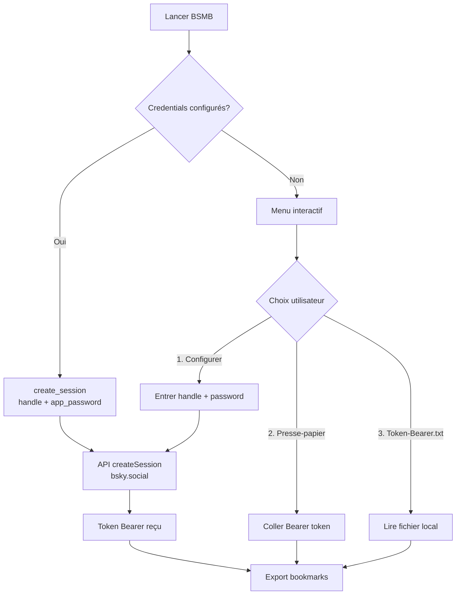
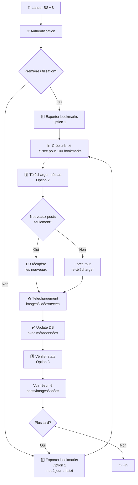
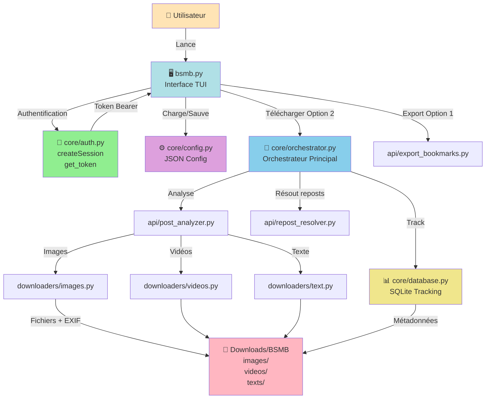
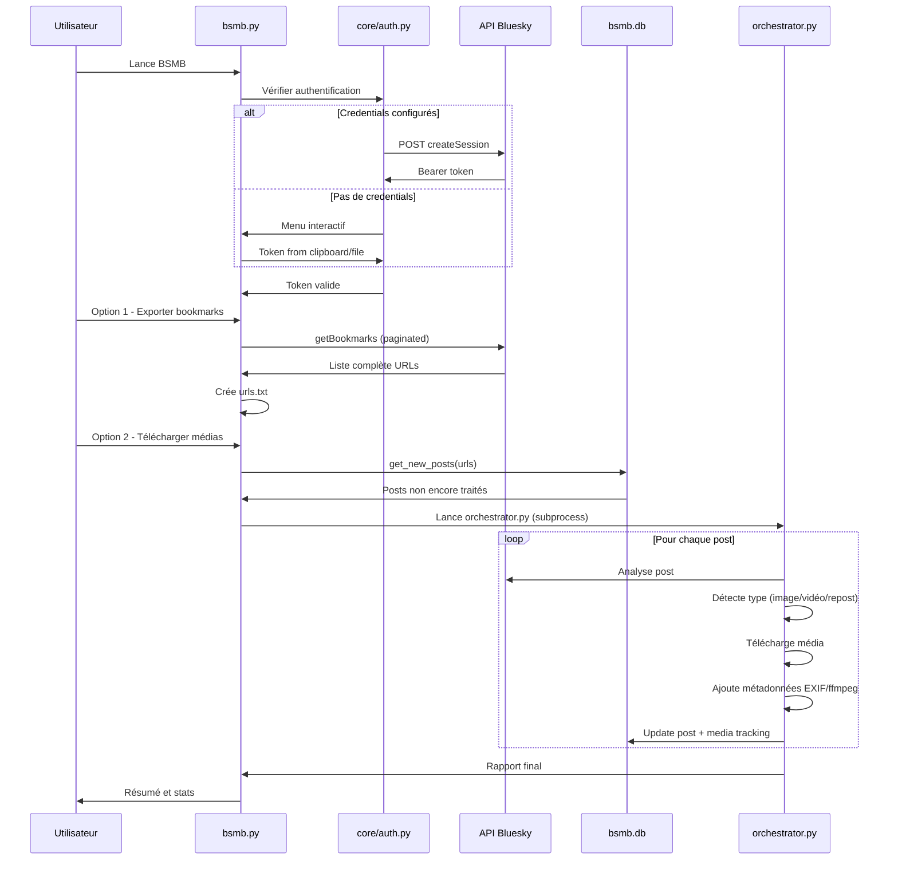
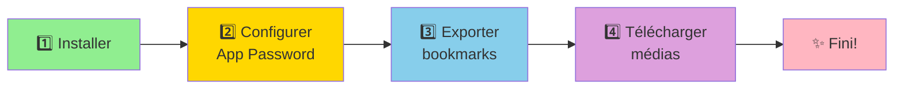

# 🔖 BSMB - Bsky Save My Bookmarks

Utilitaire pour exporter et télécharger vos bookmarks Bluesky avec suivi automatique et résolution des reposts.

---

## 📖 Table des matières

- [Installation rapide](#-installation-rapide)
- [Guide d'utilisation](#-guide-dutilisation)
- [Structure du projet](#-structure-du-projet)
- [Fonctionnalités](#-fonctionnalités)
- [FAQ](#-faq)
- [Dépannage](#-dépannage)
- [Éthique et Traçabilité](#-éthique-et-traçabilité)

---

## 🚀 Installation rapide

### Windows
1. **Double-cliquez sur `Start.bat`**
2. L'installation automatique des prérequis se lance :
   - Python 3.12 (si absent)
   - pip install requests yt-dlp
   - ffmpeg via Chocolatey
   - exiftool via Chocolatey
3. **Patientez** pendant l'installation (peut prendre quelques minutes)
4. BSMB se lance automatiquement

### Linux/Mac
```bash
# Installer Python 3.8+ et pip si nécessaire
sudo apt install python3 python3-pip ffmpeg exiftool  # Debian/Ubuntu
# ou
brew install python ffmpeg exiftool  # macOS

# Installer les dépendances Python
pip install requests yt-dlp

# Lancer BSMB
python bsmb.py
```

---

## 🎯 Guide d'utilisation

### 📋 Première utilisation

#### 1️⃣ Authentification (automatique avec createSession)

BSMB supporte **deux modes d'authentification** :

**Mode 1 : Authentification automatique (recommandé)** ⭐
```
Menu Configuration > Identifiants Bluesky
  → Entrez votre handle (@user.bsky.social)
  → Entrez votre App Password (généré sur bsky.app)
  → Test de connexion automatique
  → Token généré à chaque lancement
```

**Mode 2 : Token Bearer manuel (fallback)**
```
Menu Authentification > Option 3 : Lire depuis Token-Bearer.txt
ou
Menu Authentification > Option 2 : Coller depuis presse-papier
```

**Pour créer un App Password :**
1. Allez sur https://bsky.app > Settings > App Passwords
2. Cliquez sur « Add App Password »
3. Nommez-le (ex: « BSMB ») et copiez le mot de passe généré (xxxx-xxxx-xxxx-xxxx)
4. Configurez-le dans BSMB

> **Sécurité :** L'App Password est stocké dans `config.json` (fichier local, hors Git). Il ne doit jamais être partagé.



**Avantages du mode createSession :**
- ✅ Token généré automatiquement à chaque lancement
- ✅ Pas besoin de le copier manuellement
- ✅ App Password stocké localement et sécurisé
- ✅ Compatible avec le fallback Token-Bearer.txt

#### 2️⃣ Exporter vos bookmarks

```
Menu principal → Option 1 : Exporter les bookmarks
```

Cette opération :
- ✅ Récupère **tous** vos bookmarks via l'API Bluesky
- ✅ Crée/met à jour le fichier `urls.txt` avec la liste des liens
- ✅ Sauvegarde l'ancien fichier en `urls.txt.bak`
- ✅ Ne télécharge **aucun média** (juste la liste)
- ⏱️ Durée : ~5 secondes pour 100 bookmarks

> **Note :** Le fichier `urls.txt` peut être utilisé tel quel dans d'autres outils (yt-dlp, wget, etc.)

#### 3️⃣ Télécharger les médias

```
Menu principal → Option 2 : Télécharger les médias (nouveaux uniquement)
```
- Ne télécharge que les posts **non traités**
- Utilise la base de données pour tracker
- Idéal pour les mises à jour régulières

**Pour tout re-télécharger :**
```
Menu → Options avancées (Option 9) → Force DL (Option 2)
```
- Force le téléchargement de **tous** les posts
- Ignore l'historique de la base de données
- Utile après une réinitialisation ou pour corriger des erreurs

---

### 🔄 Workflow recommandé



**Mises à jour régulières :**
1. Lancez l'export (Option 1) → met à jour `urls.txt`
2. Téléchargez les nouveaux (Option 2) → seuls les nouveaux posts sont traités
3. Vérifiez les stats (Option 3) → vue d'ensemble
4. Profit ! 🎉

---

### ⚙️ Fonctionnalités avancées

#### Mode Développement
```
Menu principal > Option 9 > Option 1 : Mode développement
```

**Utilité :** Tester avec une liste restreinte d'URLs sans modifier la base de données.

**Comment faire :**
1. Éditez `urls.txt` et ne gardez que quelques URLs de test
2. Lancez le mode développement
3. Les médias seront téléchargés mais la DB ne sera pas mise à jour
4. Parfait pour tester ou retraiter des posts spécifiques

#### Réinitialiser la base de données
```
Menu principal > Option 4 : Statistiques > R : Réinitialiser
```

**Quand l'utiliser :**
- Vous voulez tout re-télécharger depuis zéro
- La base de données est corrompue
- Vous avez changé de configuration

⚠️ **Attention :** Cette action ne supprime **pas** les fichiers déjà téléchargés.

---

## 🗂️ Architecture et structure

### Architecture générale



### Structure des fichiers

```
bsmb/
├── bsmb.py                      # 🖥️ Interface principale (menu TUI) ⭐
├── Start.bat                    # Lanceur Windows automatique
├── Instructions-token.md        # 📖 Guide configuration app password
├── README.md                    # 📚 Cette documentation
│
├── config.json                  # ⚙️ Configuration utilisateur (auto-créé)
├── bsmb.db                      # 📊 Base de données SQLite (auto-créé)
├── Token-Bearer.txt             # 🔑 Token Bearer fallback (optionnel)
├── urls.txt                     # 📋 Liste des bookmarks (auto-créé)
├── urls.txt.bak                 # 💾 Sauvegarde auto (auto-créé)
│
├── core/                        # 🎯 Logique métier centralisée
│   ├── colors.py               # 🎨 Gestion couleurs ANSI cross-platform
│   ├── auth.py                 # 🔐 Authentification createSession + token
│   ├── config.py               # ⚙️ Configuration multi-OS
│   ├── database.py             # 📊 Tracking SQLite des posts/médias
│   └── orchestrator.py         # 🎭 Orchestrateur principal (subprocess)
│
├── api/                         # 🌐 Interactions API Bluesky
│   ├── export_bookmarks.py     # 📤 Export bookmarks via getBookmarks
│   ├── post_analyzer.py        # 🔍 Analyse type post (image/vidéo/repost)
│   └── repost_resolver.py      # 🔄 Résolution des reposts
│
├── downloaders/                 # ⬇️ Téléchargeurs (subprocess)
│   ├── images.py               # 🖼️ Téléchargement images avec EXIF
│   ├── videos.py               # 🎬 Téléchargement vidéos avec ffmpeg
│   └── text.py                 # 📝 Sauvegarde texte seul
│
├── logs/                        # 📝 Fichiers logs (auto-créé)
│   ├── orchestrator_*.log      # Logs détaillés du téléchargement
│   ├── error_400_*.txt         # Posts supprimés
│   ├── error_500_*.txt         # Erreurs serveur
│   └── ...autres fichiers...   # Reposts, types inconnus, échecs
│
└── tools/                       # 🛠️ Utilitaires optionnels
    └── debug_post.py           # 🐛 Debug détaillé d'un post
```

### Flux de données



---

## 🔐 Comparaison des modes d'authentification

| Aspect | **createSession (Recommandé)** | **Token Bearer manuel** |
|--------|-------|--------|
| **Configuration** | Handle + App Password (une seule fois) | Token Bearer copié manuellement |
| **Renouvellement** | Automatique à chaque lancement | Manuel (token expire en quelques jours) |
| **Sécurité** | App Password local, stocké dans config.json | Token stocké dans Token-Bearer.txt ou presse-papier |
| **Facilité** | ⭐⭐⭐⭐⭐ Très facile | ⭐⭐⭐ Moyen |
| **Fallback** | Oui, vers Token-Bearer.txt si échec | Utilisé comme mode principal |
| **Exposition réseau** | Minimal (juste le post API) | Chaque requête API inclut le token |

---

## 🌟 Fonctionnalités

### ✅ Export flexible
- **urls.txt seul** : Option 1 crée seulement la liste des liens
- **Sauvegarde auto** : `urls.txt.bak` créé avant chaque export
- **Réutilisable** : Fichier compatible avec yt-dlp, wget, curl, etc.
- **Pas de doublon** : Détection automatique des pages vides
- **Interruptible** : Arrêt dès qu'il n'y a plus de nouveaux bookmarks

### ✅ Téléchargement intelligent
- **Pas de doublons** : Base SQLite track tous les téléchargements
- **Nouveaux uniquement** : Mode incrémental par défaut
- **Force mode** : Option pour tout re-télécharger si besoin
- **Résolution des reposts** : Détecte et télécharge le post original
- **Gestion des erreurs** : Posts supprimés, erreurs serveur, types inconnus

### 📦 Métadonnées complètes
- **Images** : EXIF avec titre, auteur, date, copyright
- **Vidéos** : Métadonnées ffmpeg (titre, commentaire, date)
- **Nommage** : `handle_YYYYMMDD_postid_N.ext`

### 🛡️ Robustesse
- Gestion d'erreurs par post
- Confirmation avant gros téléchargements
- Logs des échecs
- Reprise possible à tout moment
- Multi-OS (Windows, macOS, Linux)

---

## ❓ FAQ et Dépannage

### Authentification

**❌ "Échec de l'authentification : Identifiants invalides"**
```
→ Vérifiez votre handle (@user.bsky.social)
→ Vérifiez que l'App Password est au format xxxx-xxxx-xxxx-xxxx
→ Assurez-vous que l'App Password n'a pas expiré
→ Recréez un nouvel App Password sur https://bsky.app/settings/app-passwords
```

**❌ "Trop de tentatives. Réessayez dans quelques minutes"**
```
→ Vous avez échoué trop de fois l'authentification
→ Attendez quelques minutes et réessayez
→ Vérifiez vos identifiants avant la prochaine tentative
```

**❌ "Impossible de se connecter à bsky.social"**
```
→ Vérifiez votre connexion Internet
→ Vérifiez que bsky.social est accessible
→ Essayez de relancer BSMB
→ Si le problème persiste, essayez le fallback Token-Bearer.txt
```

### Export et téléchargement

**❌ "Aucun bookmark trouvé"**
```
→ Vérifiez que vous avez des bookmarks sur Bluesky
→ Assurez-vous que le token est valide (pas expiré)
→ Menu Configuration > Identifiants Bluesky > Re-entrez vos identifiants
```

**❌ "Aucun média trouvé"**
```
→ Le post ne contient peut-être que du texte
→ Vérifiez l'URL du post dans votre navigateur
→ L'API Bluesky a peut-être changé (rare)
→ Mode debug : Menu Avancé > debug_post.py pour analyser
```

**❌ "Erreur téléchargement vidéo"**
```
→ L'API Bluesky a peut-être modifié le format
→ Essayez Menu Avancé > Force DL pour re-télécharger
→ Ouvrez une issue sur GitHub avec l'URL problématique
```

**❌ "ffmpeg/exiftool introuvable"**
```
→ Les médias seront téléchargés SANS métadonnées
→ Pour les avoir, installez-les :
   - Windows : Menu démarrage > Chocolatey > choco install ffmpeg exiftool
   - macOS : brew install ffmpeg exiftool
   - Linux : sudo apt install ffmpeg libimage-exiftool-perl
```

### Base de données

**❌ "Erreur SQLite"**
```
Menu → Option 3 (Statistiques) → R (Réinitialiser)
→ ou supprimez manuellement bsmb.db (il sera recréé)
⚠️ ATTENTION : Les fichiers téléchargés NE seront PAS supprimés
```

**❌ "Post marqué comme traité mais erreur"**
```
→ La DB ne marque un post comme traité que si AU MOINS un média
  a été téléchargé avec succès
→ Si erreur partielle (ex: image OK, vidéo KO), le post est traité
→ Utilisez Menu → Options avancées → Force DL pour re-télécharger
```

**✅ "Comment réinitialiser sans perdre les fichiers?"**
```
Menu → Option 3 (Statistiques) → R (Réinitialiser)
→ Supprime l'historique de la DB
→ NE supprime PAS les fichiers déjà téléchargés
→ À la prochaine export + téléchargement, tout re-télécharge
```

### Autres problèmes

**❌ "BSMB plante au lancement"**
```
→ Essayez de supprimer config.json et bsmb.db
→ Relancez BSMB (recréera avec valeurs par défaut)
→ Sinon, lancez avec : python bsmb.py 2>&1 | notepad
→ Envoyez l'erreur via GitHub issue
```

**❌ "Les couleurs ne s'affichent pas"**
```
→ Windows 10/11 : Essayez Windows Terminal au lieu de CMD
→ Vous pouvez désactiver les couleurs via env var : set NO_COLOR=1
→ ou les forcer : set FORCE_COLOR=1
```

**✅ "Comment utiliser urls.txt avec d'autres outils?"**
```
yt-dlp -a urls.txt                          # Avec yt-dlp
wget -i urls.txt                            # Avec wget
curl -L $(cat urls.txt | head -1)          # Avec curl
```

---

## 🔐 Éthique et Traçabilité

**BSMB n'est pas un outil de piratage.** Il respecte scrupuleusement les créateurs de contenu :

### Métadonnées préservées

**Pour les images** (via EXIF) :
- `Title` : ID du post Bluesky
- `XPComment` : Texte du post + URL complète
- `Artist` : Handle de l'auteur (@username)
- `DateTimeOriginal` : Date de création du post
- `Copyright` : URL complète du post

**Pour les vidéos** (via ffmpeg) :
- `title` : ID du post Bluesky
- `comment` : Texte du post + URL complète
- `artist` : Handle de l'auteur (@username)
- `creation_time` : Date de création du post

### Nommage transparent

Format : `handle_YYYYMMDD_postid_N.ext`

Exemple : `artiste_20260110_3abc123xyz_01.jpg`

Chaque fichier est **traçable** vers son post d'origine. L'ID du post permet de retrouver la source exacte sur Bluesky.

### Respect des droits

- ✅ Sauvegarde personnelle de vos bookmarks (usage privé)
- ✅ Conservation des attributions d'auteur
- ✅ Liens vers les posts originaux
- ❌ Pas de suppression de watermarks
- ❌ Pas de redistribution encouragée

Si vous partagez un média téléchargé, **citez toujours l'auteur original** et incluez le lien du post Bluesky.

---

## 🚀 Démarrage rapide (en 2 minutes)



### Étape 1: Installation
```bash
# Windows (automatique)
Start.bat

# ou Linux/Mac
python bsmb.py
```

### Étape 2: Créer un App Password
1. Allez sur https://bsky.app → Settings → App Passwords
2. Cliquez « Add App Password »
3. Nommez-le « BSMB » et copiez le mot de passe (xxxx-xxxx-xxxx-xxxx)

### Étape 3: Exporter
```
Menu BSMB → Option 1 → Entrez vos identifiants
```

### Étape 4: Télécharger
```
Menu BSMB → Option 2 → Confirmez
```

---

## 📝 Notes importantes

- **Authentication :** createSession génère automatiquement un token à chaque lancement (pas besoin de le recopier)
- **Token Bearer (legacy) :** Expire après quelques jours/déconnexion
- **Fallback :** Si createSession échoue, BSMB essaie Token-Bearer.txt
- **URLs format :** `bsky.app/profile/handle/post/id`
- **Base de données :** Ne stocke PAS les médias, juste le tracking
- **urls.txt :** Réutilisable avec d'autres outils :
  ```bash
  yt-dlp -a urls.txt
  wget -i urls.txt
  ```
- **urls.txt.bak :** Créé automatiquement à chaque export (sauvegarde)

---

## 🔒 Sécurité et confidentialité

### Données stockées localement
- ✅ `config.json` : Vos paramètres (handle, app password)
- ✅ `bsmb.db` : Métadonnées des posts/médias téléchargés
- ✅ `urls.txt` : Liste de vos bookmarks
- ✅ Fichiers médias : Images, vidéos, textes

### Aucune transmission
- ✅ Aucun upload de vos données
- ✅ Aucun tracking externe
- ✅ Aucun analytics
- ✅ Juste des requêtes vers l'API Bluesky (autorisées)

### Sécurité du token
⚠️ **NE PARTAGEZ JAMAIS votre App Password**
Il permet un accès complet à votre compte Bluesky.

✅ **L'App Password est sécurisé :**
- Stocké uniquement dans `config.json` (fichier local)
- Jamais transmis en HTTP non-sécurisé
- Rarement (1x/lancement) envoyé à bsky.social via HTTPS
- Jamais uploadé ailleurs

---

## 📄 Licence

Projet personnel - Utilisation libre
Respectez toujours les droits des créateurs de contenu.

---

## 🤝 Signaler un bug

Trouvez un problème ? 🐛 Signalez-le sur [GitHub Issues](https://github.com/Gotcha26/Bluesky-Save-My-Bookmarks/issues)

Inclure :
- La version BSMB
- La plateforme (Windows/Mac/Linux)
- L'erreur exacte (message d'erreur, logs)
- Les étapes pour reproduire

---

## 📊 Versions et changelog

**Version 2.1** - Février 2026
- ✨ Authentification automatique via createSession
- ✨ Refonte UI avec menu-generator patterns
- ✨ Classe Colors cross-platform avec détection Windows kernel32
- 🐛 Corrections des accents français

**Version 2.0** - Janvier 2025
- ✨ Architecture modulaire (core, api, downloaders)
- ✨ Base de données SQLite pour tracking
- ✨ Résolution des reposts automatique
- ✨ Support métadonnées (EXIF, ffmpeg)

---

**Made with ❤️ for Bluesky bookmarks preservation**